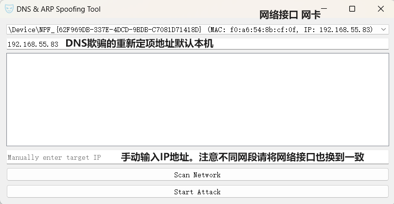

# DNS & ARP Spoofing Tool

## 项目简介
PyQt5图形化的 DNS 和 ARP 欺骗的工具(Dns spoofing And Arp spoofing)。能扫局域网能手动切换网卡。能支持多目标。   
哥们闲着写着玩，想在市面上找个趁手的工具玩都没有，反正别人都造好轮子，组装组装简简单单就完成了。   



## 功能 
GUI界面  
自由切换网络接口（网卡）  
扫描局域网存活IP  
选择局域网存活的IP作为攻击目标（也可以手动输入）  
DNS欺骗指定定向IP  
Arp+DNS 双欺骗攻击同时进行  
快捷键 `win+p` 隐藏/显示 应用  

## 要求
- Python 3.x （本地要求）
- [npCap (WinPcap)](https://nmap.org/download.html#windows)  （必须）
- [Nmap](https://nmap.org/download.html#windows)  （必须）

## 使用方法
1. **下载构建包**：
   Nnuitka打包  
   [DNS & ARP Spoofing Tool](https://github.com/lanzeweie/DNS-ARP-Spoofing-Tool/releases)  
2.启动即可使用    
注意：DNS欺骗功能并没有一同启动web服务器，如果需要定向网站请自行启动80端口的http服务。  

### 本地开发 
1. **克隆项目**：
   ```bash
   git clone <项目的 Git 仓库地址>
   cd <项目目录>
   ```
2. **创建虚拟环境（可选）**：
   为了避免依赖冲突，可以创建一个虚拟环境：
   ```bash
   python -m venv venv
   source venv/bin/activate  # 在 Windows 上使用 venv\Scripts\activate
   ```
3. **安装依赖**：
   使用以下命令安装项目所需的所有依赖：
   ```bash
   pip install -r requirements.txt
   ```

Nnuitka PyQT5打包:  
```
python -m nuitka --standalone --onefile --main="arp-ans-attact-tool.py" --windows-icon-from-ico="build\9k1xp-9nxcx-001.ico" --enable-plugins="anti-bloat" --company-name=" lanzeweie" --product-name="Arp and Dns Spooding Tools" --file-version="1.0" --enable-plugin=pyqt5 --windows-disable-console --include-data-file=build\9k1xp-9nxcx-001.ico=9k1xp-9nxcx-001.ico
```
Nnuitka PyQT5打包 有控制台 debug:  
```
python -m nuitka --standalone --onefile --main="arp-ans-attact-tool.py" --windows-icon-from-ico="build\9k1xp-9nxcx-001.ico" --enable-plugins="anti-bloat" --company-name="lanzeweie" --product-name="Arp and Dns Spooding Tools" --file-version="1.0" --enable-plugin=pyqt5 --include-data-file=build\9k1xp-9nxcx-001.ico=9k1xp-9nxcx-001.ico --output=arp-ans-attact-tool-debug
```

## 安全问题
本程序仅供教育和研究目的，严禁在未经授权的公共环境中使用。使用此工具进行未授权的攻击是违法的，务必在合法和道德的环境中使用。请确保在合法的环境中使用此工具，避免对他人网络造成损害。使用者需自行承担使用风险。在使用 ARP 欺骗和 DNS 欺骗时，请确保你有权限进行这些操作。

### 安全使用指南
1. **合法授权**：在使用本工具之前，请确保你已经获得了网络所有者的明确授权。未经授权的网络攻击是违法的。
2. **测试环境**：建议在隔离的测试环境中使用本工具，以避免对生产网络造成影响。
3. **风险评估**：在执行任何网络攻击之前，请进行充分的风险评估，确保不会对目标网络造成不可逆的损害。
4. **日志记录**：在使用本工具时，建议开启详细的日志记录，以便在出现问题时能够追溯和分析。
5. **定期更新**：保持工具和依赖项的定期更新，以确保使用最新的安全补丁和功能。

### 法律责任
使用本工具进行未授权的网络攻击可能会违反当地的法律法规。用户需自行承担使用本工具所带来的法律责任。开发者不对任何因使用本工具而产生的直接或间接损害负责。

### 道德规范
请遵守网络安全的道德规范，不要利用本工具进行恶意攻击。网络安全研究应以提升整体安全水平为目的，而非破坏他人网络。

## 贡献
欢迎对本项目进行贡献。如果你有任何建议或改进，请提交 pull request 或在 issues 中反馈。

## 许可证
本项目采用 MIT 许可证，详细信息请参阅 LICENSE 文件。